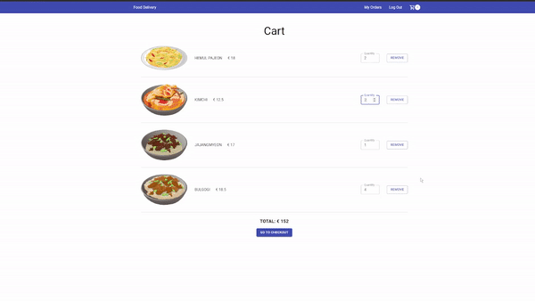

# Korean House Application
It is an web application where users can order Korean food.

  
    Click (https://youtu.be/mQRu7cY_LsE) to watch full demo video.

## ⚙️ Features

**Sign Up**
A user can create an account with email.

**Log In**
A user can sign in with email.

**Use Cart**
A user can put menus on the cart. The data can be retrieved from firebase when login after logout.

**Checkout**
A user can pay for an order. (test card number: 4242 4242 4242 4242)

**Order History**
A user can see previous orders in chronogically descending order.

## 📌 Lessons from the project

- CRUD using Firebase Firestore.
- Save and display Timestamp data from Firebase.
- Set up payment in the front-end side with Stripe API.

## 👩🏻‍🔧 Future Improvement

- Improve

## 💻 Technologies

- React
- Firebase
- Stripe API for payment
- Material UI

## 🔨 Set up

- Download and install Git
- `> git clone https://github.com/chepark/react-food-delivery.git`
- `> npm install`
- `> npm start`
